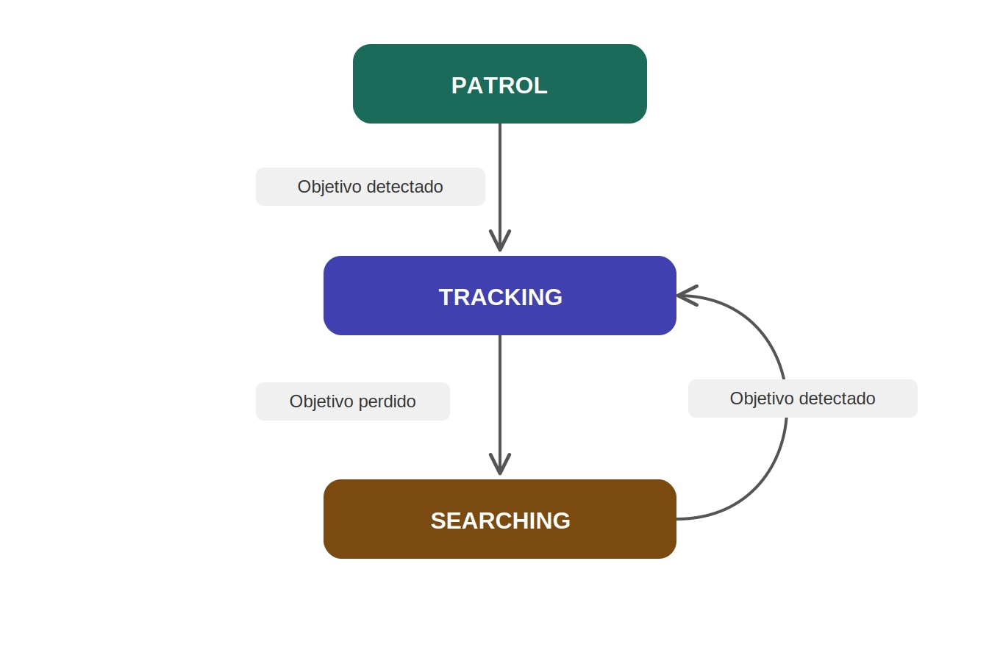
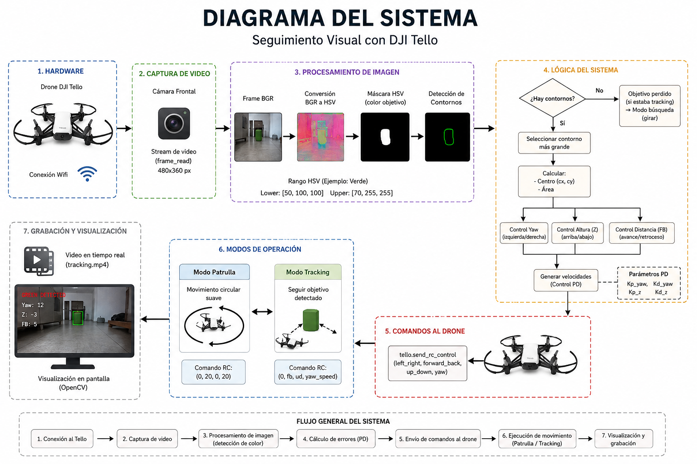

# Final Project — Color Patrol & Tracking

An evolution of Practice 4: the drone patrols in a circle until it detects a green target and switches to tracking mode (yaw, altitude, and forward/back based on the object's area) until the target is lost, at which point it goes back to searching by rotating in place.

## Overview

| | |
|---|---|
| **Drone** | DJI Tello |
| **SDK** | [djitellopy](https://github.com/damiafuentes/DJITelloPy) |
| **Goal** | Combine patrolling and PD-based visual tracking in a single state machine |

## Files

| File | Description |
|---|---|
| [`project.py`](project.py) | `patrol` / `tracking` state machine with a fixed green HSV target: PD control on yaw/altitude, and distance control based on contour area. Records to `tracking.mp4`. |
| [`state_machine_white.jpg`](state_machine_white.jpg) | Diagram of the patrol/tracking state machine. |
| [`drone.png`](drone.png) | Reference image of the drone for the report/presentation. |

## State machine



## Drone



## Requirements

```bash
pip install djitellopy opencv-python numpy
```

## How to run

```bash
python project.py
```

The drone takes off, patrols in a circle, and switches to tracking once it spots something green. Press `q` to quit or `l` to land early.
